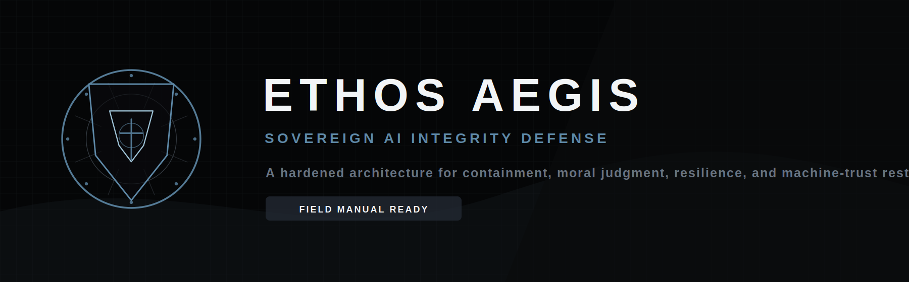
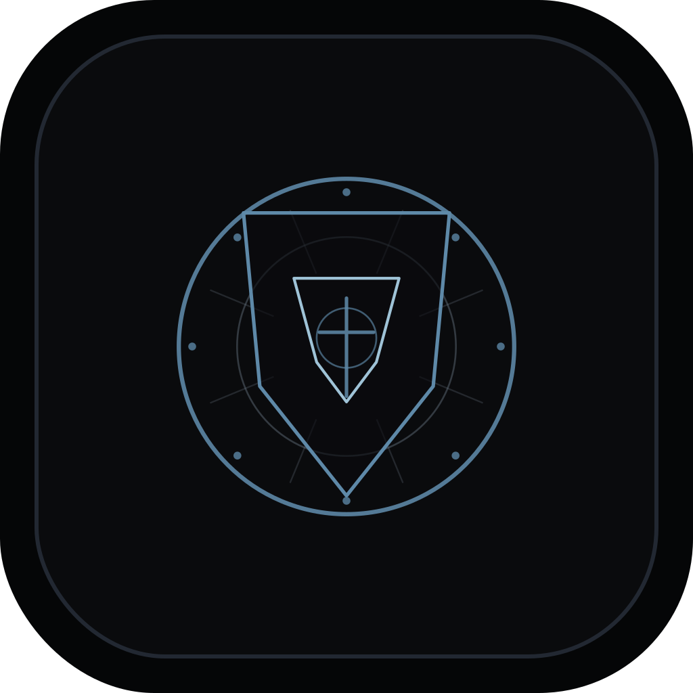
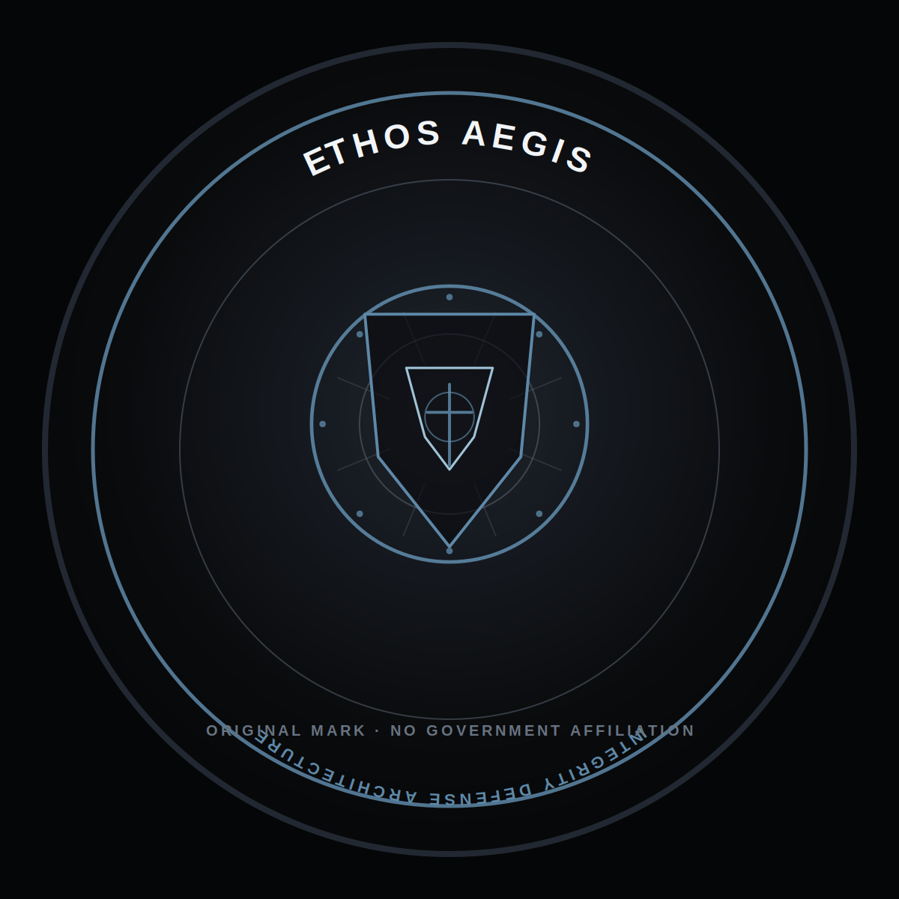
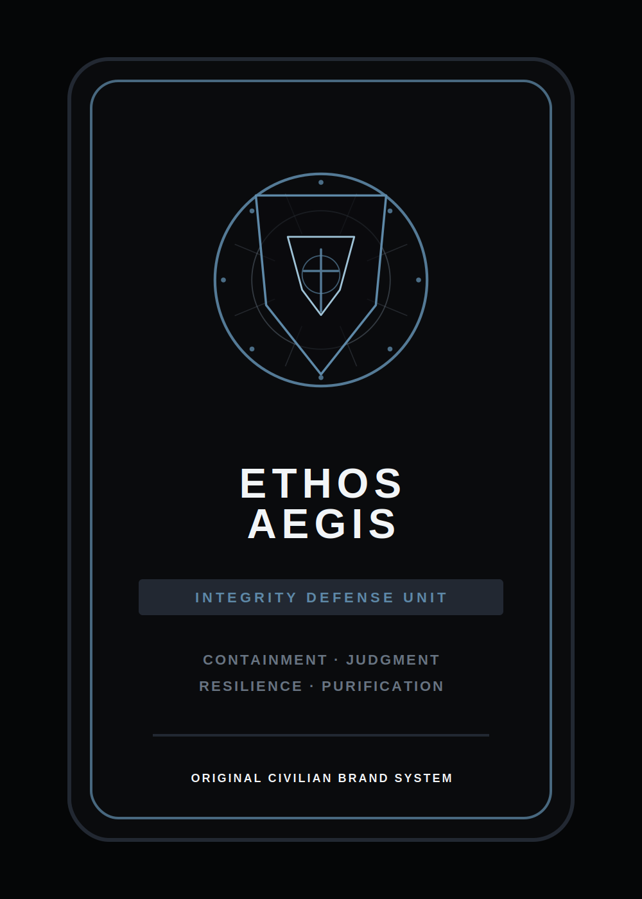
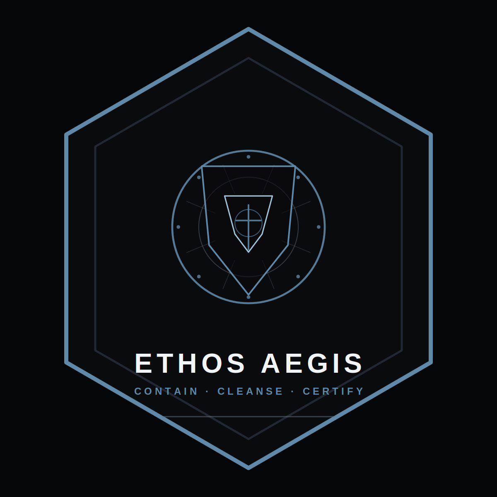

<p align="center">
  
</p>

# living-docs-template &middot; <sub><sup>Ethos Aegis</sup></sub>

> Self-demonstrating, always-current documentation. Source code, examples, and README are kept in sync by CI — a stale README is a build failure, not a documentation debt item.

[](https://github.com/DeontewattsV1/Ethos-Aegis-/actions/workflows/docs.yml)
[](https://github.com/DeontewattsV1/Ethos-Aegis-/actions/workflows/examples.yml)
[](https://github.com/DeontewattsV1/Ethos-Aegis-/actions/workflows/readme.yml)
[](./BRAND.md)

<!-- last-verified: 2026-05-22T21:43:45.057Z -->

---

## What this is

A template that proves its own documentation is current. Every fenced code block in this README is **regenerated from disk by CI** — it references a file under `examples/` by region marker, not by copy/paste. Every rendered output block is captured by running the example and snapshotting stdout.

The subject library is intentionally tiny: a typed `EventEmitter` with `on`, `once`, `off`, `emit`, error routing, and listener counts. Big enough to populate distinct examples, small enough to stay out of the way.

A larger **Python sibling** lives under [`python/`](./python/README.md) — the broader Ethos Aegis research codebase. The two stacks share **nothing at the language level** (separate lockfiles, separate CI workflows, separate test runners); they only share the living-docs philosophy.

## Try It

| | |
|---|---|
| **Gitpod**         | [](https://gitpod.io/#https://github.com/DeontewattsV1/Ethos-Aegis-) |
| **CodeSandbox**    | [](https://codesandbox.io/p/github/DeontewattsV1/Ethos-Aegis-/main) |
| **StackBlitz**     | [](https://stackblitz.com/github/DeontewattsV1/Ethos-Aegis-) |
| **Devcontainer**   | Open in VS Code and select "Reopen in Container" — environment ready in under 60 seconds. |

## Quick start

```bash
git clone https://github.com/DeontewattsV1/Ethos-Aegis-.git
cd Ethos-Aegis-
npm install
make verify       # runs all examples, diffs against snapshots
npm run repl      # interactive session with the library preloaded
```

Canonical entry points (see `Makefile`):

| Command | Effect |
|---|---|
| `make demo`    | Run one representative example. |
| `make docs`    | Regenerate README snippets + output snapshots. |
| `make verify`  | Run all examples, validate against snapshots. |
| `make test`    | Vitest with coverage. |
| `make repl`    | Interactive REPL with the library preloaded. |

## Examples

Each block below references a file under `examples/`. The contents are written by `scripts/sync-readme.ts` from the live source; the output blocks are written by `scripts/run-examples.ts`.

### Subscribe

<!-- example:basic/01-subscribe.ts -->
```ts
import { EventEmitter } from "../../src/index.js";

type Events = { greet: [name: string] };

const bus = new EventEmitter<Events>();

bus.on("greet", (name) => {
  console.log(`hello, ${name}`);
});

bus.emit("greet", "ada");
bus.emit("greet", "grace");
```

<!-- output:basic/01-subscribe.ts -->
```
hello, ada
hello, grace
```

### Emit

<!-- example:basic/02-emit.ts -->
```ts
import { EventEmitter } from "../../src/index.js";

type Events = { tick: [n: number] };

const bus = new EventEmitter<Events>();

let total = 0;
bus.on("tick", (n) => {
  total += n;
});

for (let i = 1; i <= 5; i++) bus.emit("tick", i);

console.log(`sum of ticks: ${total}`);
console.log(`listeners on 'tick': ${bus.listenerCount("tick")}`);
```

<!-- output:basic/02-emit.ts -->
```
sum of ticks: 15
listeners on 'tick': 1
```

### Once

<!-- example:basic/03-once.ts -->
```ts
import { EventEmitter } from "../../src/index.js";

type Events = { ready: [] };

const bus = new EventEmitter<Events>();

let calls = 0;
bus.once("ready", () => {
  calls++;
  console.log("ready handler fired");
});

bus.emit("ready");
bus.emit("ready");
bus.emit("ready");

console.log(`handler fired ${calls} time(s)`);
```

<!-- output:basic/03-once.ts -->
```
ready handler fired
handler fired 1 time(s)
```

### Unsubscribe

<!-- example:basic/04-off.ts -->
```ts
import { EventEmitter } from "../../src/index.js";

type Events = { ping: [] };

const bus = new EventEmitter<Events>();

const handler = () => console.log("pong");

const unsubscribe = bus.on("ping", handler);

bus.emit("ping");
bus.emit("ping");

unsubscribe();

const notified = bus.emit("ping");
console.log(`listeners notified after unsubscribe: ${notified}`);
```

<!-- output:basic/04-off.ts -->
```
pong
pong
listeners notified after unsubscribe: 0
```

### Error handling

<!-- example:advanced/05-error-handling.ts -->
```ts
import { EventEmitter } from "../../src/index.js";

type Events = { work: [payload: string] };

const bus = new EventEmitter<Events>();

bus.onError((err, event) => {
  const msg = err instanceof Error ? err.message : String(err);
  console.log(`[err on ${String(event)}] ${msg}`);
});

bus.on("work", (payload) => {
  if (payload === "boom") throw new Error("listener exploded");
  console.log(`processed: ${payload}`);
});

bus.emit("work", "task-1");
bus.emit("work", "boom");
bus.emit("work", "task-3");
```

<!-- output:advanced/05-error-handling.ts -->
```
processed: task-1
[err on work] listener exploded
processed: task-3
```

### Typed events

<!-- example:advanced/06-typed-events.ts -->
```ts
import { EventEmitter } from "../../src/index.js";

type AppEvents = {
  login: [user: { id: string; name: string }];
  logout: [user: { id: string }];
  message: [from: string, body: string];
};

const bus = new EventEmitter<AppEvents>();

bus.on("login", (user) => {
  console.log(`login: ${user.name} (${user.id})`);
});

bus.on("message", (from, body) => {
  console.log(`<${from}> ${body}`);
});

bus.on("logout", (user) => {
  console.log(`logout: ${user.id}`);
});

bus.emit("login", { id: "u1", name: "Ada Lovelace" });
bus.emit("message", "u1", "Hello, world.");
bus.emit("logout", { id: "u1" });
```

<!-- output:advanced/06-typed-events.ts -->
```
login: Ada Lovelace (u1)
<u1> Hello, world.
logout: u1
```

### Interactive walkthrough

<!-- example:interactive/07-repl-walkthrough.ts -->
```ts
/**
 * REPL-friendly walkthrough. Each line is something you could paste into the
 * REPL session opened by `npm run repl`.
 */
import { EventEmitter } from "../../src/index.js";

type Events = {
  hello: [name: string];
  goodbye: [name: string];
};

const bus = new EventEmitter<Events>();

// Step 1 — subscribe
const offHello = bus.on("hello", (name) => console.log(`> hello ${name}`));

// Step 2 — emit
bus.emit("hello", "world");

// Step 3 — once
bus.once("goodbye", (name) => console.log(`> goodbye ${name} (this fires once)`));
bus.emit("goodbye", "world");
bus.emit("goodbye", "world"); // no output

// Step 4 — unsubscribe
offHello();
const notified = bus.emit("hello", "void");
console.log(`> after unsubscribe, listeners notified: ${notified}`);
```

<!-- output:interactive/07-repl-walkthrough.ts -->
```
> hello world
> goodbye world (this fires once)
> after unsubscribe, listeners notified: 0
```

## Architecture

The key architectural decision is the **region marker contract** — the README never contains source-of-truth code, only references. Everything flows one direction:

```
examples/*.ts  ──►  sync-readme.ts   ──►  README.md code blocks
examples/*.ts  ──►  run-examples.ts  ──►  docs/output-snapshots/
docs/output-snapshots/ + README.md   ──►  readme.yml CI validation
```

| File | Role |
|---|---|
| `src/`                          | The library being documented. |
| `examples/`                     | Live code referenced from the README. |
| `docs/output-snapshots/`        | Captured stdout per example. Committed to the repo. |
| `docs/guides/`                  | Long-form concept docs. |
| `docs/api/`                     | Auto-generated TypeDoc output. |
| `scripts/sync-readme.ts`        | Pulls live code into README fenced blocks. |
| `scripts/run-examples.ts`       | Executes examples, captures stdout. |
| `scripts/validate-docs.ts`      | Diffs expected vs actual; fails CI on drift. |
| `.github/workflows/docs.yml`    | Regenerates docs on push to `main`. |
| `.github/workflows/examples.yml`| Smoke-runs every example. |
| `.github/workflows/readme.yml`  | Link-checks + marker resolution. |

See [docs/guides/concepts.md](docs/guides/concepts.md) for the full contract.

## Success criteria

- `make verify` passes on a fresh clone with only `npm install` run first.
- README code blocks are byte-equal to the files in `examples/`.
- Opening the repo in Gitpod or the devcontainer produces a working environment in under 60 seconds.
- Adding a new example file and running `make docs` automatically surfaces it in the README without manual edits — drop a file, add the marker block, run `make docs`.

## Brand

The repo ships with the **Ethos Aegis** identity kit — original, civilian, government-grade aesthetic with no real military or government insignia. See [`BRAND.md`](./BRAND.md) for the full mark library, palette tokens, and usage rules; the source SVGs live under [`assets/brand/`](./assets/brand/).

<p align="center">
  
  &nbsp;&nbsp;
  
  &nbsp;&nbsp;
  
  &nbsp;&nbsp;
  
  &nbsp;&nbsp;
  
</p>

## License

Apache-2.0 — see [LICENSE](LICENSE).
